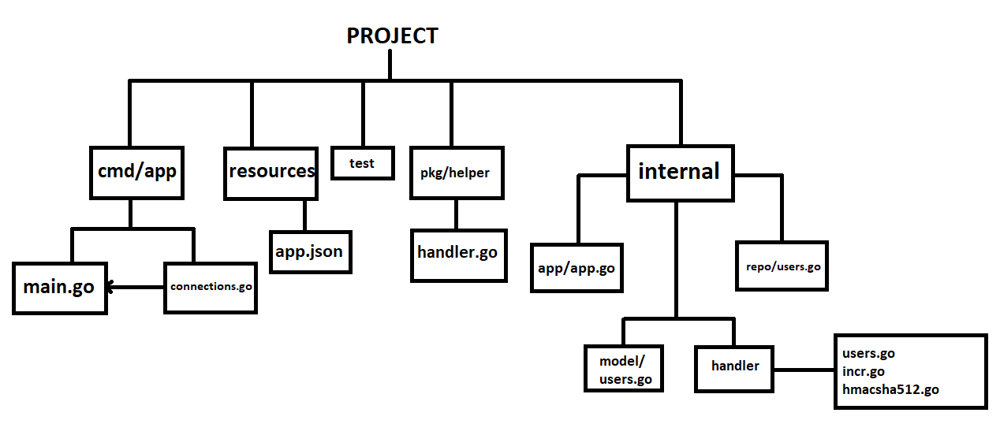
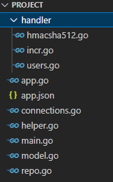

# Тестовое задание ZenTotem

Здраствуйте)

Я сделал данное задание с "умеренным инженерным подходом", т.е постарался не пихать в проект лишние библиотеки 
(использовались лишь: redis/go-redis/v9, jackc/pgx/v4/pgxpool, tkanos/gonfig),
но и не расписывать всю работу по одноразовым источникам (ввиду простоты приложения). 

Некоторые компоненты я сделал переиспользуемыми.

## Build
Но перед тем как разбираться с устройством данного приложения, быстро о том, как это вообще запустить.

1. Для начала убеждаемся, что у нас запущен Postgre-Server и Redis-Server. Далее переходим в "testProject/resources/", открываем или создаем app.json, где указываем параметры:
```json
{
    "SERVER_ADDR": ":8080",

    "POSTGRES_ADDR": "localhost:5432/write here your db name",
    "POSTGRES_USER_NAME": "write your name here",
    "POSTGRES_PASSWORD": "write your pass here"
}
``` 
2. Переходим в cmd/app

```cmd
$ cd ../cmd/app
```
3. И запускаем
```cmd
$ go run . -host localhost -port 6370 // или ваш host и port - redis 
```

Готово!
____

Итак, схема приложения выглядит так: 

<p align="center">
  <a href="https://raw.githubusercontent.com/Toor3-14/testProject/main/content/scheme.png" rel="noopener" target="_blank">
	
  </a>
</p>

Многовато всего для маленького приложения...

____

## Но!

На деле всё проще.

- cmd/app/main.go и cmd/app/connections.go - Собирают данные для конфигурации приложения:
    a. Из аргументов приложения (-host, -port) для Redis,
    b. Из resources/app.json, где должны быть поля (SERVER_ADDR, POSTGRES_ADDR, POSTGRES_USER_NAME, POSTGRES_PASSWORD).

  Создает пул подключений к PostgreSQL и создает клиент для Redis, кидает их в параметры конфигурации приложения (internal/app/app.go).

- Далее через app.go будет производится логгирование и манипуляции с бд. 
  Кроме того он хранит метод Start, который запускает сконфигурированный сервер.
  После конфигурирования, появляется доступ к его функциям, 
  задача которых - предостваление доступа к полям Application structбез возможности их изменить.

- internal/handler - хранит соответствующие handler'ы: 
    a. users (строгая валидация json), 
    b. incr (умеренная валидация json),
    c. hmacsha512 (умеренная валидация json).
  Использовал строгую валидацию для users handler для примера.
  Валидация json происходит через pkg/helper/handler.go, он содержит необходимые функции, которые предполается переиспользовать.

- internal/repo - хранит репозиторий (UserRepo struct) для таблицы users (методы initDB, insert). Именно UserRepo мы используем в app.
- internal/model - на будущие (для getUser...)

____

Конечно можно было бы сделать как-то так:
<p align="center">
  <a href="https://raw.githubusercontent.com/Toor3-14/testProject/main/content/easy.png" rel="noopener" target="_blank">
	
  </a>
</p>

Но эту мешанину при расширении проекта пришлось бы долго рефакторить, проще было бы переписать.
Хотя и мою "мешанину" надо рефакторить, но хотя бы не так сильно)

____

В общем и целом как-то так. 
Надеюсь, что вы еще не расшибли себе лоб и мы скоро увидемся!
